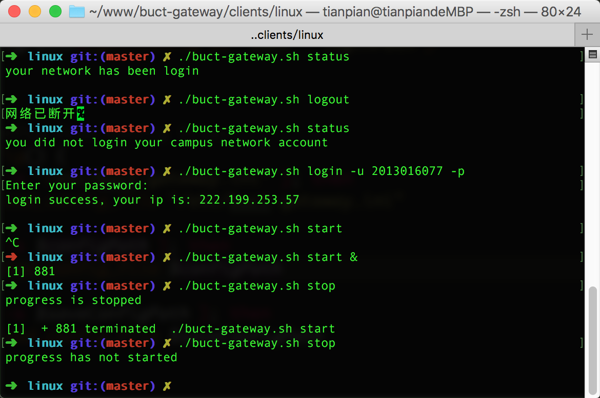

## BUCT-Gateway

This is a buct campus network automatic gateway tool, you can run it on Mac、Linux even in Router. You just run it in Router in the daemon way and you set it to run on Router boot and you have never login the gateway account, the script will do it


## Feature

* To detect the network environment is a campus network
* To detect whether have login gateway account
* To automatic login when the network in campus and disconnection
* Run a daemon progress to automatic detect and login in 24 hours
* Quickly Login and logout


## Requirement

The all Linux platform if it installed curl、awk and other basic Linux software


## Installation

### On Mac、Linux、Router
curl -o buct-gateway.sh https://raw.githubusercontent.com/yuan1994/buct-gateway-dev/master/clients/linux/buct-gateway.sh && chmod a+x buct-gateway.sh

### On Windows

Todo

## Configuration

You can use the tool only in the terminal or you can create a configuration file to be better experience.
You can find the example configuration file in the directory `clients/exampl-config.ini`, and you can copy it to `/etc/buct-gateway.ini` or in current directory, then modify the configuration file. If you use the configuration file that you can use it and needn\`t set parameter in the terminal


## Usage

Please use `buct-gateway.sh help` show usages


## Examples

```
// Show current network status
buct-gateway.sh status
// Will return: your network has been login

// Directly login
buct-gateway.sh login -u 2013016077 -p
// Input your password and will return: login success, your ip is: 222.199.253.57

// Directly logout
buct-gateway.sh logout
// If you set the configuration file, and set the username and password in configuration file that you can leave out the parameter in the terminal, and it will return: 网络已断开

// Start a daemon progress
buct-gateway.sh start -f &
// If you input the `&` after `start` then the progress will run in 24 hours, if you want to stop if please see `buct-gateway.sh stop`. The parameter `-f` meaning force, set it to force to login when the account is login in other place

// Stop a daemon progress
buct-gateway.sh stop
// Stop the daemon progress, if not run and throw a error. It will return: progress has not started

// Show usages
buct-gateway.sh help
// Will return the all usages
```


## Best Practice

### use it on router

1. Find the tutorial to open the ssh function on the internet
2. Login to the router
3. See the section for Install and install it
4. Edit your configuration
5. Set it run on boot, the progress will run when the router electricity, the order to set you can refer to below.
```
# vim /etc/rc.local
insert the order before `exit`
/path/to/buct-gateway.sh start &
```
6. Congratulations! You will never login the campus gateway!

### use it on Mac or Linux computer

Please see the practice on the router, set it run on boot or run it manual in yourself


## Contribution

First thank your contribution! If you want to contribute the code please you abide by the code specification and the complete comments


## F&A

Q1. On router run it and throw exception `-ash: buct-gateway: not found`

A1: edit the buct-gateway.sh file and find the first line `#!/bin/bash` then delete it and save it, run it again


## License

Apache-2.0
